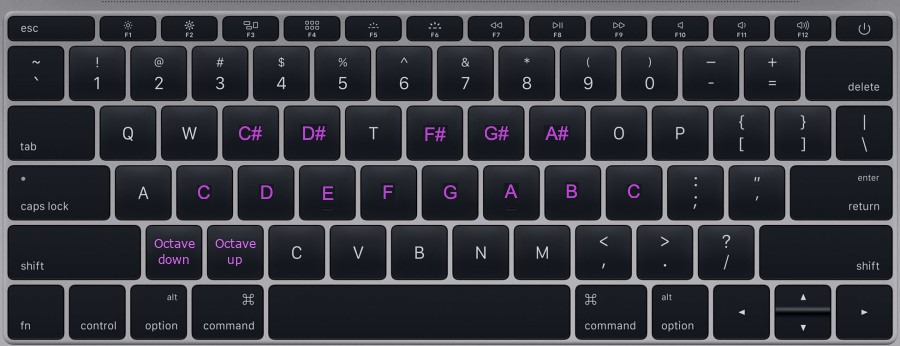
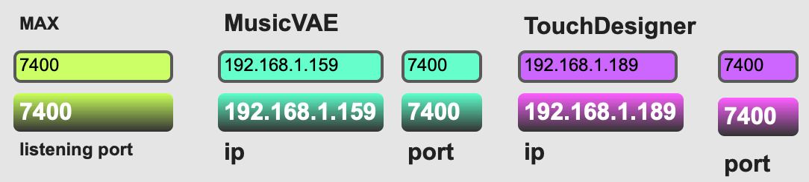
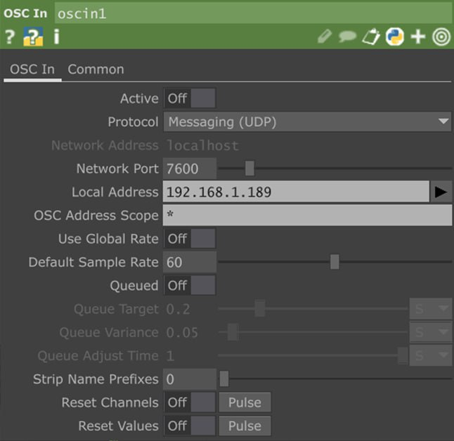

# BODY SOUND
”Body Sound” is a project whose aim is to develop a virtual musical instrument for an artistic installation.<br/><br/>
It can be used by an artist in order to make his performance more appealing thanks to the graphic visualization, but it can also have educational purposes to teach the sounds of the different grades of the scale.<br/><br/>
The system uses a sensor (camera) that receives information from the external real environment and then a visual representation reacts to the inputs given by showing a graphic representation on a screen and playing some sounds.

<p align="center">

</p>

## Installation
Download this repository and all the specific software:
* [Visual Studio Code](https://code.visualstudio.com/)
* [Max8](https://cycling74.com/downloads)
* [TouchDesigner](https://derivative.ca/UserGuide/Install_TouchDesigner)

Download all the required libraries by running on the Visual Studio Code terminal:
```bash
pip install -r .\requirements.txt
```

In order to use in particular the Magenta library you have to use Python version: 3.7.9<br></br>
Moreover, you have also to install the last commit of the last working build of Magenta:
```bash
pip install git+https://github.com/magenta/magenta.git@67c5ec3d220613ceea3e234a2917030da2a5fa85
```

You should also download the pre-trained model for the Multi-Track VAE and add it to the folder 3_MUSICVAE/content:

https://storage.cloud.google.com/download.magenta.tensorflow.org/models/music_vae/multitrack/model_chords_fb64.ckpt.data-00000-of-00001


It is suggested to use different machines for performance and computational issues.
You can set up the communication between devices via OSC protocol, for the sake of simplicity all the ports in the programs are set to default as 7400.

Open all the files into the *1 - MAIN* folder in their dedicated programs and run them contemporarily since it is a real-time project:
* *MusicVAE.py* file Visual Studio Code (it is better to run it exclusively on a single device since it requires a lot of CPU)
* *body_main.py* file with Visual Studio Code
* *Ciaone* file with Max8
* *TouchDesigner_Visual.toe* file with TouchDesigner

For Max8 set on the program your IPs on the first lines of blocks. The second line tells you which IPs and Ports you are using.
<p align="center">

</p>
Furthermore, you must run Max8 after the compilation of *body_main.py* and *MusicVAE.py*. Use the START button to make it work.
<p align="center">

</p>

In order to allow communication between the modules you have to set up clients/servers.<br></br>
For MusicVAE.py are requested as input from the keyboard:
* MaxIPv4 device
* Current device IPv4
  
For body_main.py are requested: 
* MaxIPv4 device
* MusicVAE IPv4 device
  
For TouchDesigner set the IP in the CHOP block "oscin1":
<p align="center">

</p>

## How to use
1. Open/Closed right hand: Controls Max8’s freeze effect;
3. Right-hand rotation.
4. Left-hand rotation: Controls a filter and a feedback delay;
5. Height of the hands
6. Expansion of the hands: Controls the reverb effect

## Video demo and Report

A video demonstration of the project is available at this [link](https://www.youtube.com/).<br></br>
A brief pdf report of the project is available at this [link](https://github.com/rickykubler/CPAC_Group_7/blob/main/CPAC_ProjectReport.pdf).

###
This application was developed as a project for the "Creative Programming & Computing" course at [Politecnico di Milano](https://www.polimi.it) (MSc in Music and Acoustic Engineering).
